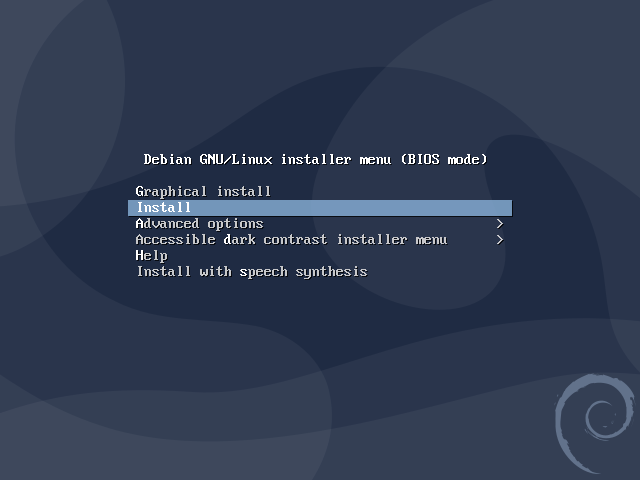
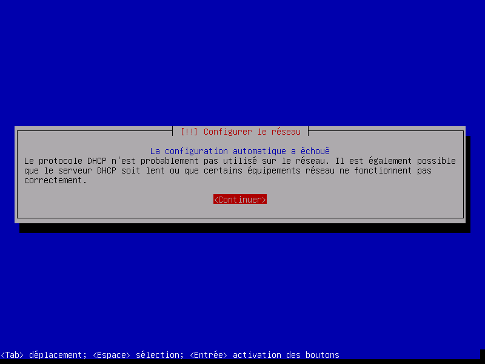
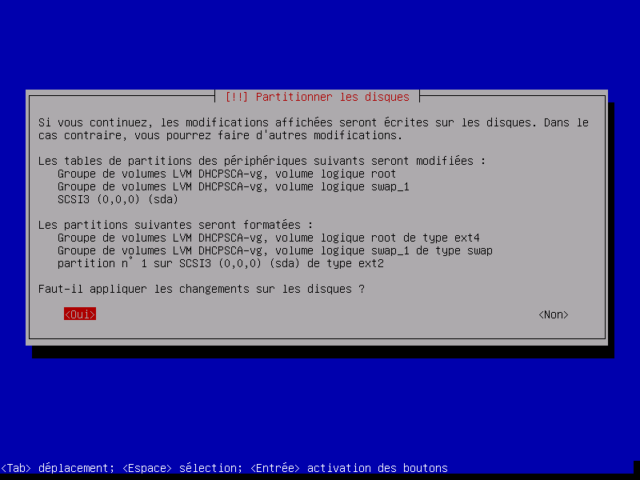

# SP0 - INTRODUCTION - Documentation DHCP

[TOC]

## Installation d'un système Linux serveur de la distribution Debian sur le poste DHCPSCA

### Installation de Debian

Pour installer Debian sur le serveur, j’utilise l’ISO de Debian 10.9
Lors du démarrage, je choisie le lecteur de CD pour pouvoir démarrer sur l’ISO de Debian.


*Capture du GRUB de l’ISO Debian*
Ensuite je dois entrés les information de la lange, ici je vais choisir le français et le clavier AZERTY.
Après la configuration du clavier, L’installer de Debian essayera de récupéré une configuration IP via un DHCP. Il y a une erreur car il n’y a pas de DHCP.

Il faut ensuite cliquer sur « Configurer vous-même le réseau ».

```
IP de la machine  : 172.16.55.2
Masque-réseau     : 255.255.255.0
Passerelle        : 172.16.55.254
DNS               : 172.16.55.1
Nom de Machine    : DHCPSCA
Domaine           : sca5.lan
```

Maintenant il faut choisir le mot de passe root `igigabbz` et je crée l’utilisateur `dhcpadmin` avec le mot de passe `uzniiueh`.

Après la configuration des utilisateur, je vais a présent partitionner les disques. Comme méthode de partitionnement j’utilise « Assisté - utiliser tout un disque avec LVM ». 
Je choisi le disque « NUTANIX VDISK ». Je vais utiliser le schéma de partitionnement « Tout dans une seule partition » et écrire les modification sur les disque. 
Je peux a présent choisir la taille du disque 21.0 GB et appliquer les changement.



> Capture des modification qui seront écrites sur le disque.

Maintenant je peux configuré l’outil de gestion des paquets, je choisi le pays du miroir de l’archive `France` et `deb.debian.org`. Il n’y a pas de proxy sur le réseau.
Après l’installation du système de base, Je choisi d’installer le GRUB sur le disque de démarrage `/dev/sda`.

### Installation et configuration du DHCP

Installation du service `isc-dhcp-server`.

```shell
sudo apt install isc-dhcp-server -y
```

Après le service installer, je modifie le fichier de configuration `/etc/dhcp/dhcpd.conf` afin de pouvoir rajouter mes différent pool.

```
default-lease-time 18000;
max-lease-time 360000;
option domain-name "sca5.lan";
option domain-name-servers 172.16.55.1;

#Réseau serveur
subnet 172.16.55.0 netmask 255.255.255.0 {
option broadcast-address 172.16.55.255;
option routers 172.16.55.253;
}

#Vlan 10 SEG
subnet 192.168.5.176 netmask 255.255.255.240 {
option routers 192.168.5.190;
range 192.168.5.177 192.168.5.189;
}

#Vlan 20 Prévention et sécurité
subnet 192.168.5.160 netmask 255.255.255.240 {
option routers 192.168.5.174;
range 192.168.5.161 192.168.5.173;
}

#Vlan 30 Animation et Insertion
subnet 192.168.5.64 netmask 255.255.255.224 {
option routers 192.168.5.94;
range 192.168.5.65 192.168.5.93;
}

#Vlan 40 Diréction Général
subnet 192.168.5.192 netmask 255.255.255.240 {
option routers 192.168.5.206;
range 192.168.5.193 192.168.5.205;
}

#Vlan 50 Entretien Bâtiments et Service des écoles
subnet 192.168.5.0 netmask 255.255.255.192 {
option routers 192.168.5.62;
range 192.168.5.1 192.168.5.61;
}

#Vlan 60 Services Techniques
subnet 192.168.5.128 netmask 255.255.255.224 {
option routers 192.168.5.158;
range 192.168.5.129 192.168.5.157;
}

#Vlan 70 Equipements sportifs
subnet 192.168.5.208 netmask 255.255.255.248 {
option routers 192.168.5.214;
range 192.168.5.209 192.168.5.213;
}

#Vlan 80 Administration Général
subnet 192.168.5.96 netmask 255.255.255.224 {
option routers 192.168.5.126;
range 192.168.5.97 192.168.5.125;
}
```


