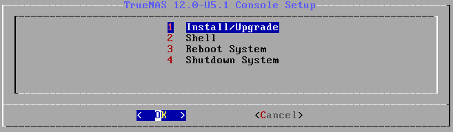
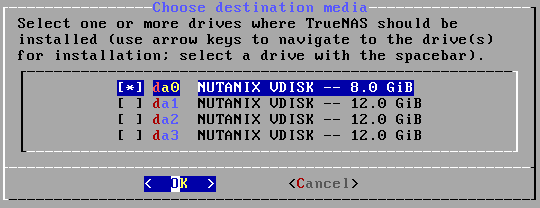
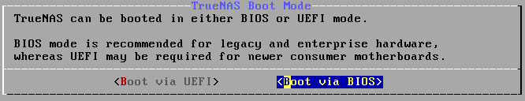
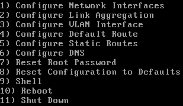
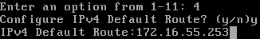
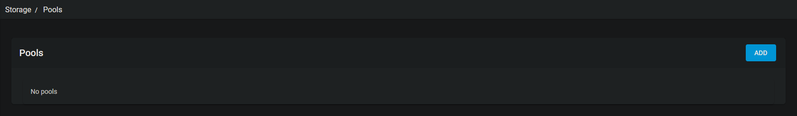
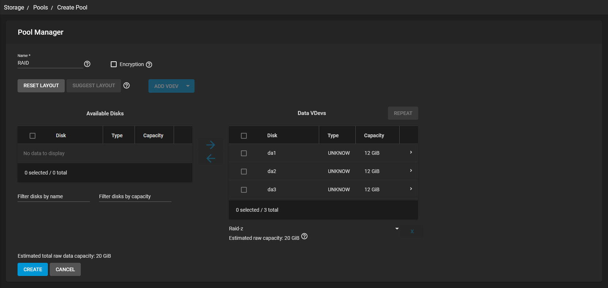

# SP0 - INTRODUCTION - Documentation TrueNas

[TOC]

## Installation de TrueNas

Pour installer TrueNAS, je vais utiliser l’ISO de TrueNAS-12. Après le démarrage de l’ISO un menu avec plusieurs choix s’ouvrira.

Je choisis l’option « Install/Upgrade » afin d’installer TrueNAS sur le disque de la machine.

Ensuite l’installateur me demandera quel disque choisir pour TrueNAS.

Je choisis le disque « da0 » de 8Go pour le système TrueNAS.

L’installeur partitionnera automatiquement le disque « da0 » pour le système TrueNAS.

Après l'installation du système l’installeur de TrueNAS demande de choisir entre UEFI et BIOS. 

Ici la configuration de démarrage de la machine virtuelle est « Legacy BIOS », alors je choisis « Boot via BIOS ».

Maintenant l’installation de TrueNAS est terminé, je peux redémarrer la machine.

## Configuration de TrueNas

### Configuration Réseau.

Pour configurer le réseau, je choisis l’option « 1 » du menu.

J’utilise la configuration réseau suivante :
DHCP : NON
NOM  : vtnet0
IPv4 : 172.16.55.20 / 24
IPv6 : NON

Après la configuration du réseau, je vais paramétrer la route par défaut, ici 172.16.55.253.

### Configuration du RAID-5

Pour configurer le raid-5, je vais utiliser le raid-z de TrueNAS qui est un équivalent au raid-5.
Je me connecte sur la page web de TrueNAS : http://172.16.55.20/.
Sur le menu de gauche je vais sur « Storage > Pools » puis « add » pour rajouter un groupe de disque.

Ensuite je choisis le nom de ma « Pool », ici ce sera « RAID ».

