# SP6 - Documentation OpenSense

[TOC]

## Installation d'OpenSense

Pour installer OpenSense. J'ai utiliser une machine virtuelle avec la configuration suivante:

- HDD  : 128 Go

- vCPU : 2

- RAM  : 8 Go

- NET  : Vlan 56 et 52

Pour l'installation, je démarre sur le CD, puis je me connecte avec l'utilisateur `root` et le mot de passe `opensense`

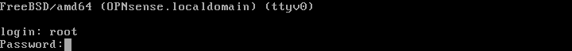

Ensuite, je sélectionne l'option `8` sur le menu. Ensuite j'entre la commande `opnsense-installer`

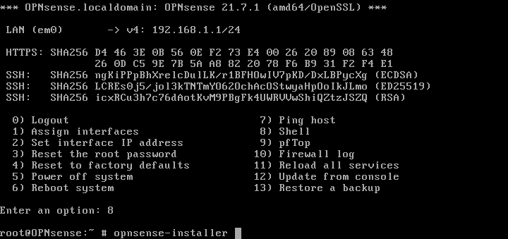

Maintenant que l'installation est lancer, je vais choisir `install (UFS)` dans le menu.

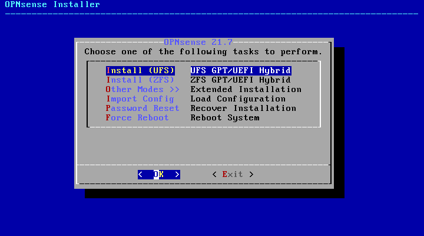

Ensuite, il faut choisir le disque pour l'installation, ici ce sera `ada0`.

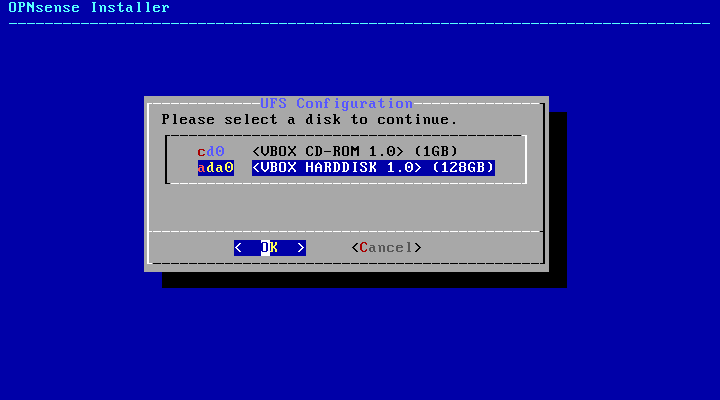

Après l'installation du système, l'installateur nous demande de changer le mot de passe de l'utilisateur `root`.

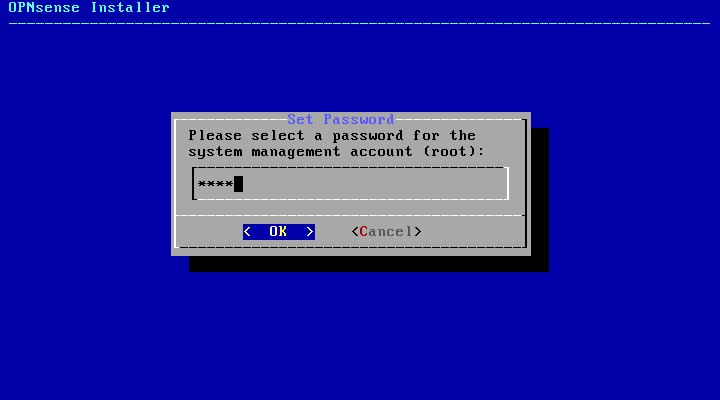

## Configuration d'OpenSense

### Ajout de la règle OpenVPN

Afin de faire fonctionner OpenVPN il faut autoriser le WAN a accéder au port 1194.
Pour se faire il faut aller sur le menu de droite. Dans l’onglet `Pare-feu > Règles > WAN`.

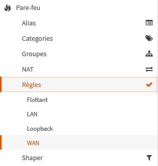

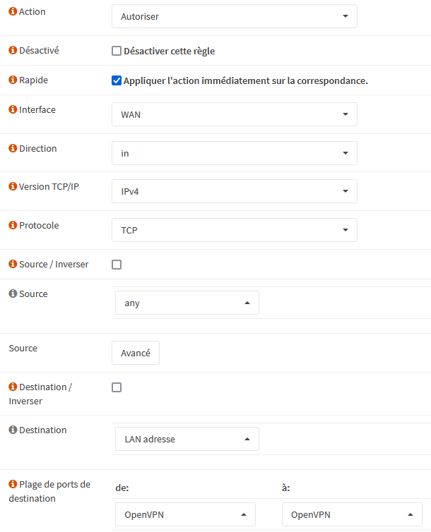

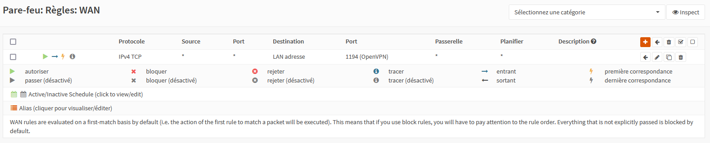

### Configuration du proxy

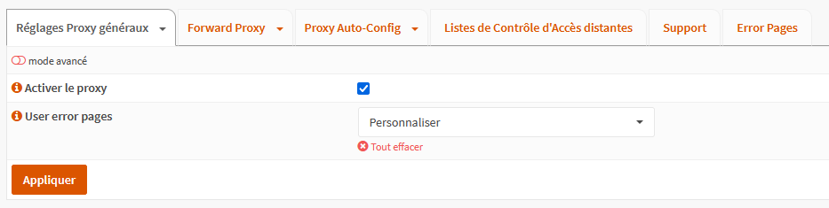

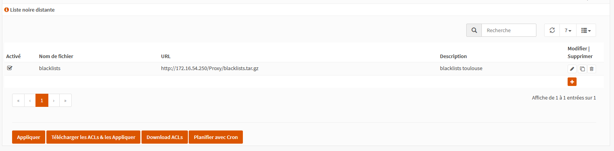

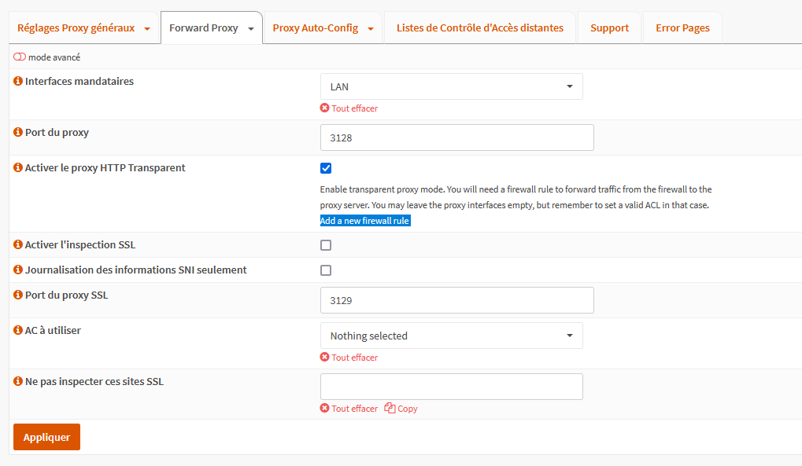
