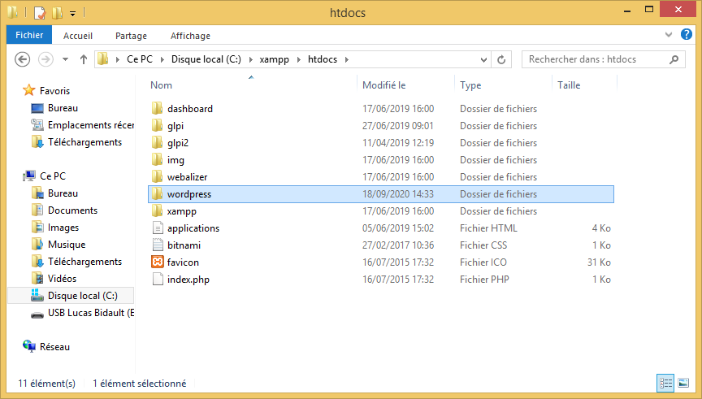

# Installation et Configuration de WordPress

[TOC]

## Prérequis

- Un poste client

- Un poste serveur

- XAMPP 3.2.4 :
  
  - MariaDB 10.3.15
  
  - Apache 2.4.39
  
  - PHP 7.3.6
  
  - phpMyAdmin 4.9.0.1

## Installation et Configuration de XAMPP

1. Tout d'abord installez XAMPP https://www.apachefriends.org/fr/download.html, ensuite ouvrez le `Control Panel` XAMPP.
   
   

> On peut voir que les services Apache et MySQL sont activés.

2. Après, il faut configurer la base de données. Connectez vous http://localhost/phpmyadmin/

> Sur `phpMyAdmin`, cliquez sur `Nouvelle base de données` et nommez là `startdev_wordpress`. 

## Installation de WordPress

Pour installer WordPress 5.5.1, il faut aller sur le site http://fr.wordpress.org/.

Ensuite, cliquez sur `Télécharger WordPress 5.5.1` afin de télécharger le fichier ZIP puis dé-zipper le fichier dans `C:\XAMPP\HTDOCS\`.

## Configuration de WordPress

Connectez vous à l'adresse http://localhost/wordpress/, sur la page de configuration rentrez les informations de la base de données configurée précédemment.

Maintenant, indiquez toutes informations nécessaires comme : (Titre du site, Identifiant et Mot de passe ainsi que la messagerie du propriétaire).

Maintenant que WordPress est installé, vous pouvez vous connecter sur http://localhost/wordpress/.

